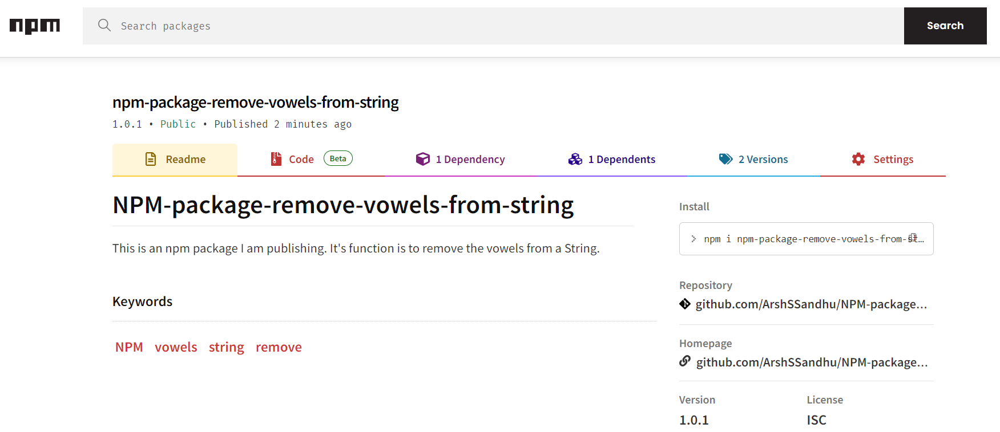

# NPM Package : Vowel Remover

Name of the package: package-remove-vowels-from-string
 Function: Removes vowels from a string

## Installation

Install the package using npm: npm i npm-package-remove-vowels-from-string

## Usage

See below for how to use this package 

## Find it on NPM

## License

This project is licensed under the MIT License. See the [LICENSE](LICENSE) file for details.

