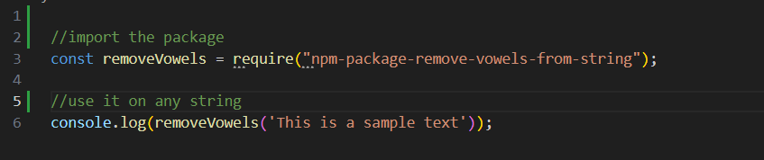

# NPM-package-remove-vowels-from-string

Name of the package: package-remove-vowels-from-string
Function: Removes vowels from a string

## Installation

Install the package using npm: npm i npm-package-remove-vowels-from-string

## Usage

See below for how to use this package 

)

